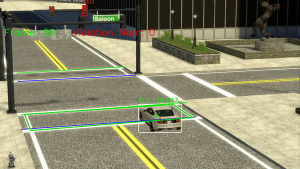
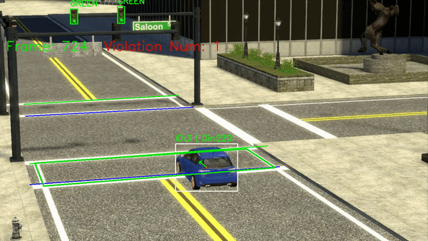
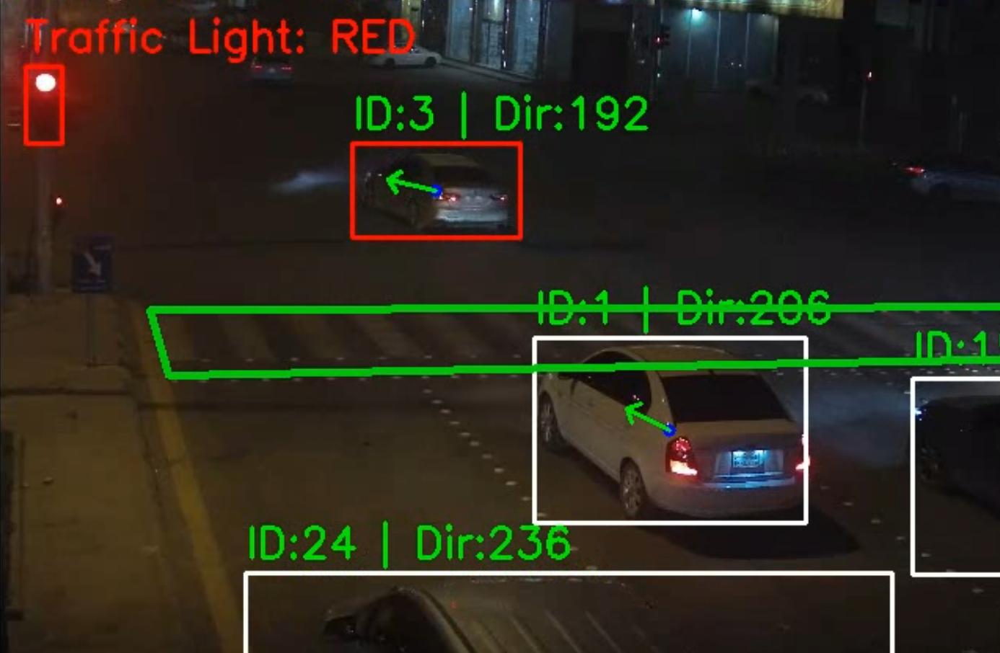
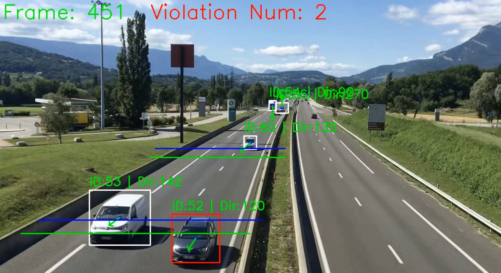

# Traffic violation detection

Detect traffic violations with CCTV footage

### Requirements
- clip==0.2.0
- numpy==1.26.2
- Pillow==10.1.0
- scipy==1.11.3
- setuptools==28.8.0
- tensorflow==2.15.0
- torch==2.1.1
- torchreid==0.2.5
- torchvision==0.16.1

*Animation data made with Blender
